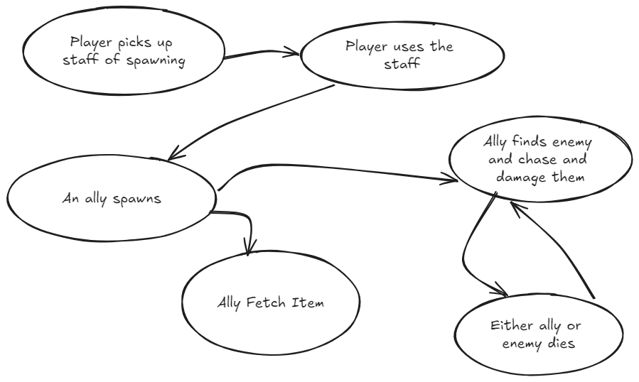
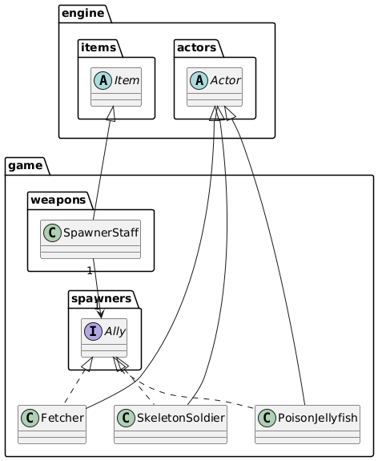

# Spawning Allies staff (weapon)

## Higher level class

- Spawner staff which is an Item

## Interface

- Ally

### Lower Level classes

*All of which are implementations of Ally and currently extensions of engine.actors.Actor*

- Skeleton Soldier
    - Can fight enemies
- Stun Jellyfish
    - Moves towards and stun the enemy for 2 turns and die
- Fetcher
    - Fetches the closest item
    - Items goes straight to player's inventory

## SOLID/DRY principles

* This adheres to SRP as all the new classes only have a single responsibility. e.g. the SpawnerStaff is responsible for
  spawning allies. The Ally interface defines common behaviours for all allies. Each of the three allies focus on
  distinct tasks. One drawback is that ally implementations may become too complex in the future when their behaviours
  are extended which could lead to a violation of SRP. (Single Responsibility Principle)
* The creation of the Ally interface allows for the extension of new ally types without modifying the SpawnerStaff code.
  But if new allies require changes to the Ally interface then this could necessitate further modifications to the
  existing concrete implementations which would violate OCP (Open/Closed Principle)
* The staff of spawning only relies on the Ally interface.
  This means that any Ally can take the place of another Ally and still be expected to perform similar responsibilities
  without unexpected behaviour occurring. (Liskov Substitution Principle)
* A single Ally interface is used for all ally types. (Interface Segregation Principle)
* SpawnerStaff relies on the abstraction Ally rather than a concrete implementation of allies. (Dependency Inversion
  Principle)

### Alternative designs
Having the SpawnerStaff depend on a new Factory design pattern

* This would still adhere to the design pattern restriction for this requirement, but it would allow for the
  SpawnerStaff
  is delegate the choice of Ally spawning to the Factory instead.
* This reduces the coupling between the SpawnerStaff and Allies which allows for easier expansion with more Ally types
  in the future
* The Factory can handle player choice when choosing which type of Ally to spawn.

Requirement approved by TA